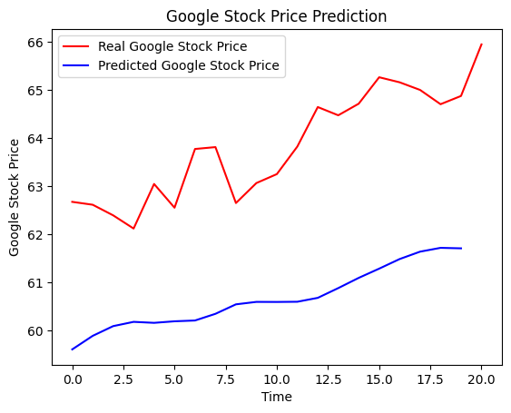

# Google Stock Price Prediction using LSTM

## Overview

This project implements a stock price prediction model using Long Short-Term Memory (LSTM) networks. The model is designed to predict future closing prices of Google stock based on historical stock market data. By analyzing trends over time, the model aims to provide investors and analysts with a tool to predict stock prices more accurately.

## Features

- **LSTM-Based Time Series Prediction**: Utilizes LSTM networks to predict stock prices, which are well-suited for time-series data.
- **60-Day Historical Data**: The model takes into account the previous 60 days of closing prices to make future price predictions.
- **Stock Market Data Preprocessing**: Prepares data by normalizing it and transforming it into a format suitable for LSTM models.

## Table of Contents

- [Overview](#overview)
- [Features](#features)
- [Installation](#installation)
- [Usage](#usage)
- [Model Architecture](#model-architecture)
- [Dataset](#dataset)
- [Results](#results)
- [Future Work](#future-work)
- [Contributors](#contributors)

## Installation

### Prerequisites

- Python 3.x
- TensorFlow
- Pandas
- Numpy
- Matplotlib
- Scikit-learn

### Setup

1. Clone the repository:

   ```bash
   git clone https://github.com/leharp/google-stock-prediction-lstm.git
   ```

3. Download historical stock data for Google from a reliable source (e.g., [Yahoo Finance](https://finance.yahoo.com/quote/GOOGL/history/)).

4. Ensure the data contains the following columns: `Date`, `Open`, `High`, `Low`, `Close`, `Adj Close`, and `Volume`.

## Usage

### Data Preprocessing

1. Load the dataset:

   ```python
   import pandas as pd
   data = pd.read_csv('GOOGL_stock_data.csv')
   ```

2. Check the data:

   ```python
   data.head()
   data.shape
   ```

3. Normalize the closing price values using `MinMaxScaler`:

   ```python
   from sklearn.preprocessing import MinMaxScaler
   scaler = MinMaxScaler(feature_range=(0, 1))
   scaled_data = scaler.fit_transform(data['Close'].values.reshape(-1, 1))
   ```

4. Prepare the training data:

   ```python
   X_train = []
   y_train = []
   for i in range(60, len(scaled_data)):
       X_train.append(scaled_data[i-60:i, 0])
       y_train.append(scaled_data[i, 0])
   
   X_train, y_train = np.array(X_train), np.array(y_train)
   X_train = np.reshape(X_train, (X_train.shape[0], X_train.shape[1], 1))
   ```

### Model Training

1. Build the LSTM model:

   ```python
   from tensorflow.keras.models import Sequential
   from tensorflow.keras.layers import LSTM, Dense

    model = tf.keras.models.Sequential([
        tf.keras.Input(shape=(60,1)),
        tf.keras.layers.LSTM(units =60, activation='relu', return_sequences=True),
        tf.keras.layers.Dropout(0.2),
        tf.keras.layers.LSTM(units =60, activation='relu', return_sequences=True),
        tf.keras.layers.Dropout(0.2),
        tf.keras.layers.LSTM(units =80, activation='relu', return_sequences=True),
        tf.keras.layers.Dropout(0.2),
        tf.keras.layers.LSTM(units =120, activation='relu'),
        tf.keras.layers.Dropout(0.2),
        tf.keras.layers.Dense(units=1)
      ])
  

2. Compile and train the model:

   ```python
   model.compile(optimizer='adam', loss='mean_squared_error')
   history = model.fit(X_train, y_train,batch_size=32, epochs=100)
   ```

### Make Predictions

1. Prepare the test data and make predictions:

   ```python
   test_data = ...
   predicted_prices = model.predict(test_data)
   predicted_prices = scaler.inverse_transform(predicted_prices)
   ```

2. Plot the results:

   ```python
   plt.plot(actual_prices, color='red', label='Real Google Stock Price')
    plt.plot(predicted_stock_price, color = 'blue', label = 'Predicted Google Stock Price')
    plt.title('Google Stock Price Prediction')
    plt.xlabel('Time')
    plt.ylabel('Google Stock Price')
    plt.legend()
    plt.show()
   ```

## Model Architecture

- **LSTM Layers**: 4 stacked LSTM layers, with 60, 60, 80 and 120 units.
- **Dropout Layers**: After each LSTM Layer with a value of 0.2.
- **Dense Layers**: Fully connected layers for output, one with 1 unit.
- **Loss Function**: Mean Squared Error (MSE).
- **Optimizer**: Adam optimizer.

## Dataset

- **Source**: Historical stock prices for Google.
- **Columns**: `Date`, `Open`, `High`, `Low`, `Close`, `Adj Close`, `Volume`.
  
The data must be preprocessed and normalized before feeding into the LSTM model.

## Results

- The model outputs a time series of predicted stock prices. The predicted values are plotted against actual stock prices for comparison.
- While the model may capture trends, stock price prediction is inherently uncertain due to market volatility.
Example Output:



## Future Work

- **Incorporate Additional Features**: Using more data like trading volume, opening prices, or other financial indicators.
- **Model Optimization**: Perform hyperparameter tuning for better predictions.
- **Real-Time Data**: Integrate real-time data streaming for live predictions.

## Contributors

- **Your Name** - [LeharP](https://github.com/LeharP)

